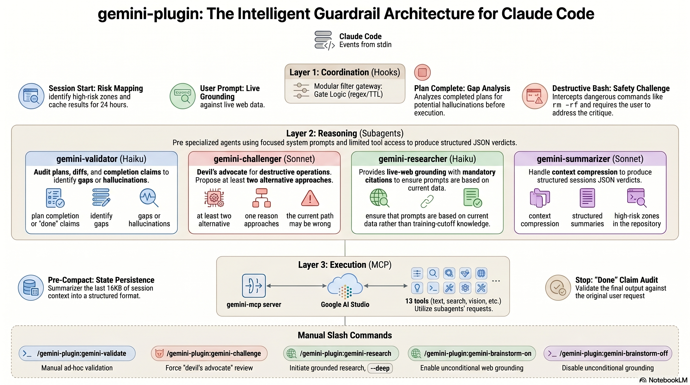

<div align="center">

# gemini-plugin

**Give Claude Code a second opinion.** Gemini validates your plans, challenges destructive commands, grounds answers in live web data, and audits "done" claims before Claude stops working.

[](https://github.com/azmym/gemini-plugin/releases)
[](LICENSE)
[](https://github.com/azmym/gemini-plugin/actions/workflows/tests.yml)
[](https://code.claude.com/docs/en/plugins)
[](https://github.com/azmym/SynthForge)
[](https://aistudio.google.com)

[Quickstart](#install) · [Why use it?](#why-use-it) · [Architecture](#architecture-at-a-glance) · [Slash commands](#slash-commands) · [Auto-triggers](#auto-triggers) · [Documentation](#documentation)

</div>

---

## Why use it?

- **Catch mistakes before they ship.** Every plan Claude produces is reviewed by Gemini for gaps and hallucinations before you see it.
- **Stop dangerous commands before they run.** When Claude is about to execute `rm -rf`, a force-push, or a `DROP TABLE`, Gemini proposes safer alternatives and can block execution until you decide.
- **Get answers grounded in today's web.** Questions about library versions, recent CVEs, or live API docs are automatically answered with citations, not training-data guesses.
- **Keep context alive across compaction.** Before Claude compacts its context, Gemini summarizes decisions, discarded alternatives, and unresolved debt so the next session picks up cleanly.
- **Verify "done" claims.** When Claude says it's finished, Gemini checks the actual output against your original ask and blocks the stop if something was missed.

## At a glance

You ask Claude to delete a branch that was never merged. Instead of running the command immediately, the plugin intercepts it:

```
⚡ gemini-challenger (destructive command detected)

Verdict: block

Alternatives:
  1. Archive the branch instead of deleting it
     git tag archive/<branch-name> <branch-name> && git branch -d <branch-name>
     Tradeoff: takes one extra step, but the ref is recoverable
  2. Create a backup tag first, then delete
     git tag backup/<branch-name> && git branch -D <branch-name>
     Tradeoff: slightly more history noise

Objections:
  - Branch has unmerged commits (checked with git branch --no-merged)

Must address:
  - Confirm: do you have a remote copy of this branch?
```

Claude pauses and shows you the critique inline. You respond, and the session continues from there.

## Install

Distributed via the [SynthForge marketplace](https://github.com/azmym/SynthForge):

```
/plugin marketplace add azmym/SynthForge
/plugin install gemini-plugin@synthforge
```

You will be prompted for your Google AI Studio API key during installation. The key is stored securely in your system keychain (not in any settings file). Get one free at [aistudio.google.com/app/apikey](https://aistudio.google.com/app/apikey).

The plugin auto-registers the `gemini` MCP server. No separate `claude mcp add` step is needed.

## What it does for you

| Situation | What fires | What you get |
|---|---|---|
| You start a session on a new repo | Risk map hook | Gemini scans for fragile zones, missing tests, and risky integrations (cached 24 h) |
| Claude finishes a plan | Plan validation hook | Gemini reviews the plan; blocks if gaps or missed acceptance criteria are found |
| Claude is about to run a destructive command | Destructive command hook | Gemini proposes alternatives; can block execution if a safer path exists |
| You ask about a library version, CVE, or live API | Prompt grounding hook | Gemini searches the web and injects citations before Claude answers |
| Claude is about to compact context | Pre-compact hook | Gemini summarizes decisions and unresolved debt so the next session starts with full context |
| Claude says it is finished | Done-claim hook | Gemini validates output against your original ask; blocks if something was missed |
| You want a second opinion right now | Slash command | Any of the four subagents on demand, for any artifact or question |

## Architecture at a glance

<p align="center">
  
</p>

Three layers do the work: **hooks** coordinate (read events, apply gates, emit directives), **subagents** reason (validator, challenger, researcher, summarizer with structured JSON verdicts), and the **gemini-mcp** server executes (calls Gemini, Imagen, Veo, and Lyria via Google AI Studio). For the full architecture write-up, see [docs/reference/architecture.md](docs/reference/architecture.md).

## Slash commands

| Command | What it does |
|---|---|
| `/gemini-plugin:gemini-validate <subject>` | Ask Gemini to check a file, plan, or claim for gaps and hallucinations |
| `/gemini-plugin:gemini-challenge <topic>` | Get at least two alternatives and a list of objections to any decision |
| `/gemini-plugin:gemini-research <query>` | Quick web search with citations (add `--deep` for multi-source synthesis) |
| `/gemini-plugin:gemini-brainstorm-off` | Opt out of grounding-on-every-prompt (recommended for chatty sessions to control cost). Falls back to narrow keyword matching. |
| `/gemini-plugin:gemini-brainstorm-on` | Re-enable grounding on every prompt after a previous opt-out (this is the default after install) |

## Auto-triggers

These fire without any action on your part:

| Trigger | When | What you see |
|---|---|---|
| Session start | Once per project per day | A risk map of high-fragility zones in your repo |
| Prompt grounding | **On every prompt by default** (opt out with `/gemini-plugin:gemini-brainstorm-off`); after opt-out, only fires on prompts matching narrow patterns like "latest version of X", "CVE-YYYY-NNN", or "changelog for X" | Citations prepended to Claude's answer |
| Plan validation | When Claude exits plan mode | A pass or a list of gaps to address before proceeding |
| Destructive command | Before `rm -rf`, `--force` pushes, `DROP TABLE`, and similar | Alternatives and a block if a safer path exists |
| Pre-compact | Before context compaction | A structured summary of decisions and open work |
| Done-claim check | When Claude signals it has finished | A pass or a list of missed requirements |

## Configuration and disable knobs

**Turn off all hooks:**

```bash
export CLAUDE_PLUGIN_GEMINI_DISABLE_HOOKS=1
```

**Disable one specific agent** (for example, if you want validation but not the challenger):

Add the agent to `permissions.deny` in your Claude Code settings:

```json
"permissions": {
  "deny": ["Agent(gemini-plugin:gemini-challenger)"]
}
```

**Brainstorm mode (on by default as of v0.2.0):**

Every prompt is grounded in live web data. This catches stale-training-data answers but does add a Gemini call (and a small latency hit) to every prompt, even trivial ones. Two ways to manage it:

```
/gemini-plugin:gemini-brainstorm-off  # opt out: falls back to keyword-only grounding
/gemini-plugin:gemini-brainstorm-on   # re-enable after a previous opt-out
```

When opted out, the grounding hook only fires on prompts that look like questions about post-cutoff information (matching patterns like `latest version of X`, `CVE-YYYY-NNN`, `changelog for X`, `deprecated in X`).

## Requirements

- Claude Code with plugin support
- A Google AI Studio API key (prompted during install, stored in system keychain)
- `uv` (provides `uvx` for running the MCP server; install at [docs.astral.sh/uv](https://docs.astral.sh/uv))
- `jq` (used by hook scripts; install with `brew install jq` on macOS)

## Documentation

Full documentation is in the [`docs/`](docs/index.md) folder:

| Section | What you will find |
|---|---|
| [Tutorial](docs/tutorial.md) | Install the plugin and run your first validation in under 5 minutes |
| [Validate plans and claims](docs/how-to/validate-plans.md) | Detailed usage patterns for plan and done-claim validation |
| [Research live data](docs/how-to/research-live-data.md) | Ground questions in current web data with citations |
| [Configure hooks](docs/how-to/configure-hooks.md) | Enable, disable, or customize the automatic triggers |
| [Reference](docs/index.md) | Architecture, skills, subagents, hooks, and commands in full detail |
| [Design decisions](docs/explanation/design-decisions.md) | Why single-turn validation, why these gates, cost tradeoffs |

## License

MIT
