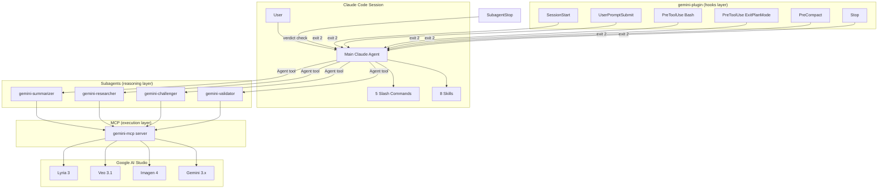
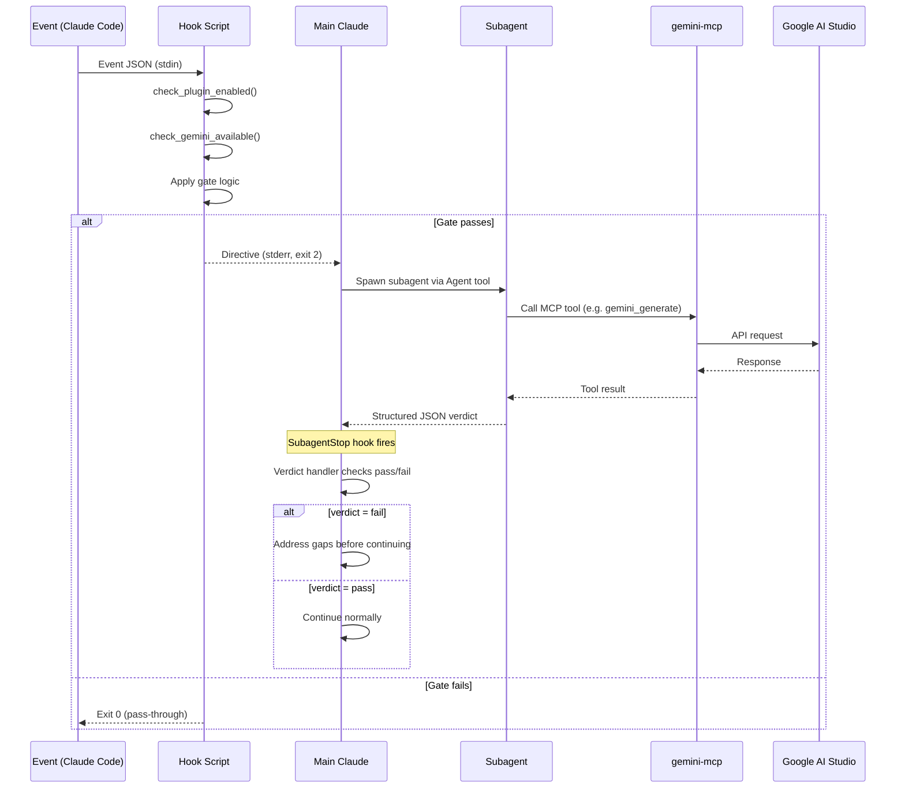
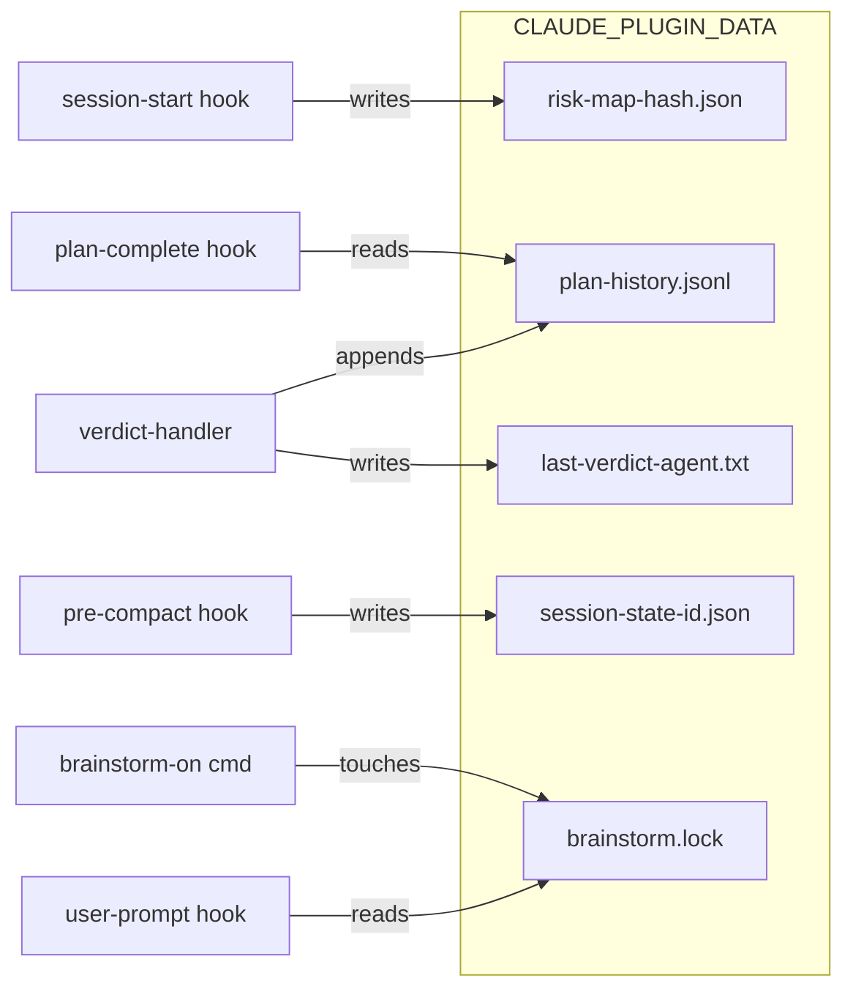

# Architecture Reference

This document describes the system architecture of gemini-plugin: how the components interact, how data flows through hooks and subagents, and how the MCP layer connects everything to Google AI Studio.

## System overview



## Three-layer architecture

The plugin separates concerns into three layers:

```
┌─────────────────────────────────────────────────────┐
│ Layer 1: COORDINATION (hooks)                       │
│                                                     │
│ - Read event JSON from stdin                        │
│ - Apply gate logic (regex, TTL, brainstorm flag)    │
│ - Emit directive to stderr                          │
│ - Exit 2 to block, exit 0 to pass                  │
│ - Never call MCP directly                           │
└─────────────────────────────┬───────────────────────┘
                              │ spawns via Agent tool
┌─────────────────────────────▼───────────────────────┐
│ Layer 2: REASONING (subagents)                      │
│                                                     │
│ - Focused system prompt per role                    │
│ - Limited tool access (read-only + MCP)             │
│ - Structured JSON output (verdict schema)           │
│ - Anti-loop rules prevent re-raising same issues    │
│ - maxTurns cap prevents runaway                     │
└─────────────────────────────┬───────────────────────┘
                              │ calls MCP tools
┌─────────────────────────────▼───────────────────────┐
│ Layer 3: EXECUTION (gemini-mcp)                     │
│                                                     │
│ - 13 MCP tools (text, image, video, music, etc.)    │
│ - google-genai SDK → Google AI Studio               │
│ - Stateless per-call (no persistent state)          │
│ - Model selection per tool call                     │
└─────────────────────────────────────────────────────┘
```

## Hook execution flow



## Component inventory

| Component | Count | Location | Purpose |
|---|---|---|---|
| Plugin manifest | 1 | `.claude-plugin/plugin.json` | Metadata, userConfig prompt, MCP server registration |
| Skills | 8 | `skills/*/SKILL.md` | When/how to use Gemini capabilities |
| Subagents | 4 | `agents/*.md` | Role-specific reasoning with structured output |
| Commands | 5 | `commands/*.md` | User-invoked slash commands |
| Hooks | 7 | `hooks/hooks.json` + `hooks/*.sh` | 6 triggers + 1 verdict handler |
| Shared library | 2 | `hooks/lib/*.sh` | JSON helpers, gates, prompt builders |
| Rules | 1 | `rules/using-gemini.md` | Session-level usage guidance |
| Marketplace | external | [SynthForge](https://github.com/azmym/SynthForge) | Distribution catalog |

## API key configuration

The plugin uses `userConfig` to prompt for the API key at install time:

```json
{
  "userConfig": {
    "gemini_api_key": {
      "type": "string",
      "title": "Gemini API Key",
      "description": "Google AI Studio API key",
      "sensitive": true,
      "required": true
    }
  }
}
```

The key is stored in the system keychain (`sensitive: true`) and injected at runtime via `${user_config.gemini_api_key}`. Users never need to export environment variables manually.

## MCP server registration

The plugin manifest auto-registers the gemini MCP server on install:

```json
{
  "mcpServers": {
    "gemini": {
      "type": "stdio",
      "command": "uvx",
      "args": ["--from", "git+https://github.com/azmym/gemini-mcp@v0.2.0", "gemini-mcp"],
      "env": { "GEMINI_API_KEY": "${user_config.gemini_api_key}" }
    }
  }
}
```

All 4 subagents inherit this MCP connection from the parent session (plugin subagents cannot define their own `mcpServers` in frontmatter).

## State management



State is local, session-scoped, and disposable. Deleting the data directory resets all state (risk maps rebuild on next session, verdicts start fresh).

## Model allocation

| Subagent | Model | Rationale |
|---|---|---|
| gemini-validator | Sonnet | Reliable structured-output for JSON verdicts; bumped from Haiku in v0.3.0 after partial-response failures |
| gemini-challenger | Opus | Hardest reasoning task (creative alternatives + objections); bumped from Sonnet in v0.3.0 |
| gemini-researcher | Sonnet | Multi-source synthesis and citation discipline; bumped from Haiku in v0.3.0 |
| gemini-summarizer | Opus | Large-input compression with structured output; bumped from Sonnet in v0.3.0 |

All subagents call Gemini models via MCP (default: `gemini-3.5-flash` for chat/search, `gemini-3.1-pro-preview` for generate). The Claude model handles orchestration and JSON structuring; the Gemini model handles reasoning and web access. The Claude-side model bumps in v0.3.0 fixed a class of partial-response failures where validator and other agents were exiting before producing the final JSON verdict.
