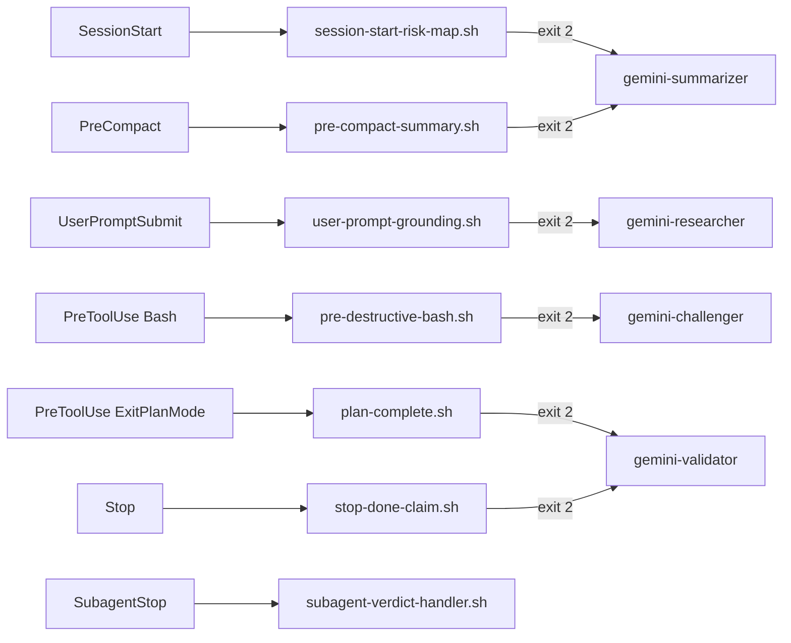

# Hooks Reference

The plugin ships 7 hooks defined in `hooks/hooks.json`. Six are triggers (read events, apply gates, emit directives). One is a verdict handler (inspects subagent output, decides block/pass).

## Hook event matrix

> **Note:** `ExitPlanMode` is a tool name, not a hook event. The plan-validation hook fires under the `PreToolUse` event with `matcher: ExitPlanMode`.

## Hook details

### session-start-risk-map.sh

| Field | Value |
|---|---|
| Event | `SessionStart` |
| Matcher | `startup` |
| Gate | TTL check: skip if `risk-map-<hash>.json` exists and is < 24h old |
| Subagent | `gemini-summarizer` (task=BUILD_RISK_MAP) |
| Blocking | Yes (exit 2) |

**What it does:** Scans the repo structure (files up to depth 4) and asks Gemini to identify high-risk zones, missing tests, complex state, and fragile integrations. Caches result for 24h.

### user-prompt-grounding.sh

| Field | Value |
|---|---|
| Event | `UserPromptSubmit` |
| Matcher | (none, fires on all prompts) |
| Gate | Always-on if `brainstorm.lock` exists; otherwise regex: `api|cve|version|release|deprecated|library|package|sdk|framework|upgrade|migrate` |
| Subagent | `gemini-researcher` (task=GROUND_PROMPT) |
| Blocking | Yes (exit 2) |

**What it does:** Grounds the user's prompt in live web data via `gemini_search_grounded`. Returns citations before Claude answers.

**Stdin JSON:** `{"prompt": "user's message text"}`

### plan-complete.sh

| Field | Value |
|---|---|
| Event | `PreToolUse` |
| Matcher | `ExitPlanMode` |
| Gate | Always fires if plan text is non-empty |
| Subagent | `gemini-validator` (task=VALIDATE_PLAN) |
| Blocking | Yes (exit 2) |

**What it does:** Validates the completed plan for gaps, hallucinations, and missed acceptance criteria. Includes last 3 rejected plans from history to avoid re-raising addressed issues.

**Stdin JSON:** `{"tool_input": {"plan": "plan markdown text"}}` (legacy `.plan` accepted for backwards compatibility).

### pre-destructive-bash.sh

| Field | Value |
|---|---|
| Event | `PreToolUse` |
| Matcher | `Bash` |
| Gate | Regex match on destructive patterns (see below) |
| Subagent | `gemini-challenger` (task=CHALLENGE_DESTRUCTIVE_OP) |
| Blocking | Yes (exit 2) |

**Destructive patterns matched (narrow on purpose to keep false-positive rate low):**
- `rm -[rRf]` flag combinations
- `git reset --hard`
- `git push ... --force` (any token order before `--force`)
- `DROP TABLE`, `DROP DATABASE`, `DROP SCHEMA`
- `TRUNCATE TABLE`
- `dd if=`
- Redirection to a raw block device (`> /dev/sd*`)

Patterns that look destructive but pass through (intentional false-positive guards):
- `git pull --force`, `npm install --force` (not destructive)
- Commit messages or text containing the word "drop" out of context

**Stdin JSON:** `{"tool_input": {"command": "the bash command"}}`

### pre-compact-summary.sh

| Field | Value |
|---|---|
| Event | `PreCompact` |
| Matcher | (none) |
| Gate | Always fires if context is non-empty |
| Subagent | `gemini-summarizer` (task=SUMMARIZE_SESSION_STATE) |
| Blocking | Yes (exit 2) |

**What it does:** Captures the last 16KB of session context and asks Gemini to produce a structured summary (decisions, discarded alternatives, unresolved debt) that survives context compaction.

**Stdin JSON:** `{"context": "session context text"}`

### stop-done-claim.sh

| Field | Value |
|---|---|
| Event | `Stop` |
| Matcher | (none) |
| Gate | Two conditions must both be true: (1) a tool was used in this session, (2) the assistant message contains completion words (`done`, `completed`, `finished`, `ready`, `fixed`, `passing`, `resolved`, `implemented`) |
| Subagent | `gemini-validator` (task=VALIDATE_DONE_CLAIM) |
| Blocking | Yes (exit 2) |

**What it does:** Validates Claude's final output against the original ask. Includes git diff summary for evidence.

**Stdin JSON:** `{"assistant_message": "...", "original_ask": "...", "tool_used": "true|false"}`

### subagent-verdict-handler.sh

| Field | Value |
|---|---|
| Event | `SubagentStop` |
| Matcher | `gemini-validator|gemini-challenger|gemini-researcher|gemini-summarizer` |
| Gate | Transcript must exist and contain parseable JSON verdict |
| Blocking | Conditional: exit 2 if verdict=fail or verdict=block; exit 0 otherwise |

**What it does:** Reads the subagent's transcript, extracts the final JSON verdict, applies the loop guard (identical verdict twice in a row is demoted to advisory), persists to plan-history.jsonl, and decides whether to block.

**Stdin JSON:** `{"agent_type": "gemini-validator", "transcript_path": "/path/to/transcript.jsonl"}`

## Exit code semantics

| Exit code | Meaning |
|---|---|
| 0 | Pass-through (hook does not intervene) |
| 2 | Block (stderr message injected into Claude's context) |

## Shared library

All hooks source two library files:

- `hooks/lib/common.sh`: `check_gemini_available`, `check_plugin_enabled`, `ensure_data_dir`, `repo_hash`, `is_brainstorming`, `get_plan_history`, `is_destructive_command`
- `hooks/lib/prompt-builder.sh`: `build_directive`, `build_risk_map_directive`, `build_grounding_directive`, `build_plan_validation_directive`, `build_destructive_challenge_directive`, `build_precompact_directive`, `build_done_claim_directive`
